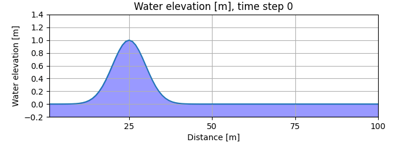

## Introduction
White revisiting Fortran through the book [Modern Fortran] by Milan Curcic, I reached Chapter 4, which dives into solving the 2D shallow water equations numerically. The chapter wraps up with a [Python script] for visualizing results as static figures, but I decided that an animation would be better to bring the solution to life. In this post, I share my approach to creating that animation using Python and Jupyter Notebook.

## Methods
To transform raw data into an animated plot, the Python libraries [NumPy] and [Matplotlib] are used. NumPy simplifies handling numerical data, while Matplotlib generates figures and animates them through the [FuncAnimation] class. To display interactive plots in Jupyter Notebooks, it's necessary the addition of [ipympl]. To save animations as videos, it is recommended the installation of a comprehensive multimedia framework, like [FFmpeg]. The import section of the code looks like this:

```python
%matplotlib ipympl
import numpy as np
import matplotlib.pyplot as plt
from matplotlib.animation import FuncAnimation, FFMpegWriter
```

The [raw data](#appendices) is a table with 5001 rows and 101 columns, where each row represents a time step in the solution of the shallow water equations. The first element of each row indicates the time step, so only the other 100 elements characterize the wave elevation `h` as a function of the spatial position `x`. The raw data is retrieved from a text file and handled as follows:


```python
data = np.loadtxt('tsunami.txt')
h = data[:,1:]
x = np.arange(1, h.shape[1]+1)
```

The next step is creating the base figure for the animation, allong with initializing the graph objects `waterline`(the water surface) and `waterfill`(the filled area bellow it). The code below describes this process:

```python
fig = plt.figure(figsize=(7, 2.5))
ax = fig.add_axes((0.12, 0.2, 0.8, 0.7))
ax.set_xlim(1, 100)
ax.set_ylim(-0.2, 1.4)
ax.set_xticks(range(25, 125, 25))
ax.set_yticks(np.arange(-0.2, 1.6, 0.2))
ax.set_xlabel('Distance [m]')
ax.set_ylabel('Water elevation [m]')
ax.grid()

# Initialization.
waterline, = ax.plot([], [])
waterfill = ax.fill_between(x, -0.2, 0, color='b', alpha=0.4)
```

The `waterflow` function handles the updates of `waterline` and `waterfill` for each time step:

```python
def waterflow(time_step):
    #waterfill update
    xverts = np.hstack((x, x[::-1]))
    yverts = np.hstack((-0.2*np.ones(x.shape), h[time_step,::-1]))
    verts = np.vstack((xverts, yverts)).T
    waterfill.set_verts([verts])

    waterline.set_data(x, h[time_step])
    ax.set_title(r'Water elevation [m], time step ' + str(time_step))

    return waterline,
```

The animation is generated by the Matplotlib `FuncAnimation` class through the execution of the `waterflow` function in a chosen sequence of time steps. The following code generates a frame every 10 time steps and displays the resulting animation:

```python
anim = FuncAnimation(fig, waterflow, frames=range(0, 5002, 10), interval=100, blit=True) 
plt.show()
```

Alternatively, the animated plot can be saved to a video format by:

```python
writer = FFMpegWriter(fps=10)
anim.save('waterflow.mp4', writer=writer)
```

## Result 
<p align="center">

</p>

## Appendices
* <a href="tsunami.txt" download>Raw data</a>
* <a href="tsunami.ipynb" download>Notebook</a>

<!--Links-->
[Modern Fortran]: https://www.manning.com/books/modern-fortran
[Python script]: https://github.com/modern-fortran/tsunami/blob/master/src/ch04/plot_water_height.py
[Matplotlib]: https://matplotlib.org/
[FuncAnimation]: https://matplotlib.org/stable/api/_as_gen/matplotlib.animation.FuncAnimation.html#matplotlib.animation.FuncAnimation
[NumPy]: https://numpy.org/
[ipympl]: https://matplotlib.org/ipympl/
[FFmpeg]: https://www.ffmpeg.org/
