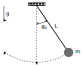

<p align="center">

</p>

## Introduction 
[Nodimo] is a [Dimensional Analysis] tool that transforms a dimensional relationship between quantities into dimensionless forms. It achieves this by grouping dimensional quantities into dimensionless products, ensuring that the number of resulting products is always less than or equal to the initial number of quantities. This process yields a dimensionless model that is both a generalization and a simplification of the original dimensional model.

Nodimo supports any number of dimensions and quantities, making it versatile for applications in science, engineering, economics and finance. The resulting dimensionless relationships provide a foundation for advanced studies in similarity and model testing.

Designed as a [Python] package, Nodimo is optimized for use in [Jupyter Notebook]. It leverages [Sympy]'s symbolic mathematics and rendering capabilities to produce elegant, readable outputs.

## Example
The following application starts with a dimensional relationship between the quantities that describe a simple pendulum:

<p align="center">
    
</p>

$$T = \phi(L, m, g, \theta_0)$$

where:

\\(T\\): Period <br>
\\(L\\): Length <br>
\\(m\\): Mass <br>
\\(g\\): Acceleration of gravity <br>
\\(\theta_0\\): Initial angle

The equivalent dimensionless model that describes the period as a function of the other quantities is created by the code below:

```python
from nodimo import Quantity, Model

T = Quantity('T', mass=0, length=0, time=1, dependent=True)
L = Quantity('L', mass=0, length=1, time=0, scaling=True)
m = Quantity('m', mass=1, length=0, time=0)
g = Quantity('g', mass=0, length=1, time=-2, scaling=True)
t0 = Quantity('theta_0')

model = Model(T, L, m, g, t0)
model.show()
```

The displayed result is:

$$\frac{T g^{\frac{1}{2}}}{L^{\frac{1}{2}}} = \Phi(\theta_0)$$

The mass was discarded because, dimensionally, it cannot be part of the problem.

The dimensionless expression is simpler and more general than the original dimensional model.

For more applications and functionalities, check the [documentation][Nodimo].

<!-- Links -->
[Python]: https://www.python.org/
[Nodimo]: https://nodimo.readthedocs.io/
[Jupyter Notebook]: https://jupyter.org/
[Sympy]: https://www.sympy.org/
[Dimensional Analysis]: https://en.wikipedia.org/wiki/Dimensional_analysis
